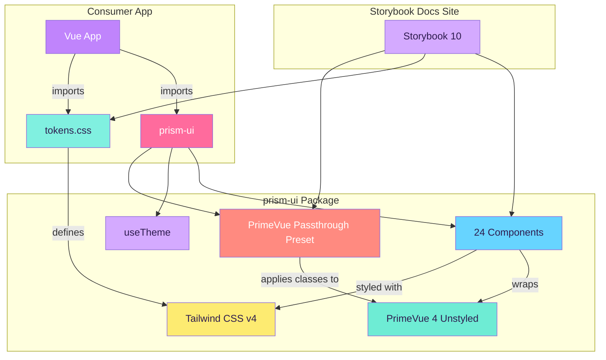

# 🔮 Prism UI

A vibrant, pastel-themed design system and component library built with Vue 3, PrimeVue 4, and Tailwind CSS v4 — documented in Storybook.

## Stack

| Layer | Technology |
|---|---|
| Framework | Vue 3 (Composition API, TypeScript) |
| Component Base | PrimeVue 4 (unstyled mode + passthrough preset) |
| Styling | Tailwind CSS v4 (custom pastel theme tokens) |
| Documentation | Storybook 10 |
| Build | Vite (library mode, ESM output) |

## Architecture



## Getting Started

```bash
# Install dependencies
npm install

# Run Storybook (development)
npm run storybook

# Build library (ESM output to dist/)
npm run build

# Build Storybook static site (to storybook-static/)
npm run build-storybook
```

## Installation (npm)

Prism UI requires **Vue 3** and **PrimeVue 4** as peer dependencies — they are not bundled with the library.

```bash
npm install prism-ui primevue vue
```

```ts
// main.ts
import { createApp } from 'vue'
import PrimeVue from 'primevue/config'
import { preset } from 'prism-ui'
import 'prism-ui/tokens.css'

const app = createApp(App)
app.use(PrimeVue, { unstyled: true, pt: preset })
```

```vue
<script setup>
import { PrButton, PrCard, PrInput } from 'prism-ui'
</script>

<template>
  <PrCard title="Hello" color="pink">
    <PrInput placeholder="Type here..." />
    <PrButton label="Submit" color="purple" />
  </PrCard>
</template>
```

## Color Palette — "Pastel Neon"

| Token | Color | Hex | Usage |
|---|---|---|---|
| `pink` | 🩷 Hot Pastel Pink | `#FF6B9D` | Primary actions, CTAs |
| `purple` | 💜 Electric Lavender | `#C084FC` | Secondary actions, accents |
| `blue` | 💙 Sky Pop | `#67D4FF` | Info, links |
| `mint` | 💚 Neon Mint | `#6EECD4` | Success, confirmations |
| `yellow` | 💛 Lemon Drop | `#FDEB71` | Warnings, highlights |
| `coral` | 🧡 Peach Punch | `#FF8A80` | Errors, destructive |
| `lilac` | 💟 Soft Lilac | `#D4AAFF` | Tags, badges |
| `aqua` | 🩵 Bubblegum Aqua | `#80F0E0` | Hover states |

### Neutrals

| Token | Light | Dark |
|---|---|---|
| `surface-0` | `#FFFFFF` | `#1a1225` |
| `surface-1` | `#FAFAFE` | `#231a30` |
| `surface-2` | `#EDE6FF` | `#332a45` |
| `text` | `#2D1B4E` | `#e8e0f0` |
| `text-muted` | `#7C6B9E` | `#9a8cb5` |

## Components (24)

### Form Controls

| Component | PrimeVue Base | Props |
|---|---|---|
| `PrButton` | Button | `label`, `variant` (solid/outline/ghost/soft), `size` (sm/md/lg), `color`, `disabled` |
| `PrInput` | InputText | `placeholder`, `status` (default/success/error), `disabled`, `v-model` |
| `PrTextarea` | Textarea | `placeholder`, `status`, `disabled`, `maxlength`, `rows`, `v-model` |
| `PrSelect` | Select | `options`, `optionLabel`, `optionValue`, `placeholder`, `status`, `disabled`, `v-model` |
| `PrCheckbox` | Checkbox | `label`, `color`, `value`, `disabled`, `v-model` |
| `PrRadio` | RadioButton | `label`, `color`, `value`, `disabled`, `v-model` |
| `PrToggle` | ToggleSwitch | `label`, `color`, `disabled`, `v-model` |

### Display

| Component | Base | Props |
|---|---|---|
| `PrBadge` | Badge | `value`, `color`, `dot` |
| `PrTag` | Custom | `value`, `color`, `removable` |
| `PrChip` | Custom | `label`, `color`, `removable`, `image` |
| `PrAvatar` | Custom | `label`, `image`, `color`, `size` (sm/md/lg) |

### Layout & Feedback

| Component | Base | Props |
|---|---|---|
| `PrCard` | Custom | `title`, `subtitle`, `color`. Slots: `header`, `default`, `footer` |
| `PrDivider` | Custom | `color`, `layout` (horizontal/vertical), `label` |
| `PrDialog` | Dialog | `header`, `modal`, `closable`, `width`, `v-model`. Slots: `default`, `footer` |
| `PrToast` | Toast | Place once, trigger via `useToast()` |
| `PrTooltip` | Custom | `text`, `position` (top/bottom). Wraps slot content |
| `PrSkeleton` | Custom | `width`, `height`, `shape` (rectangle/circle) |
| `PrProgressBar` | Custom | `value`, `color`, `height`, `showValue` |
| `PrAccordion` | Accordion | `items: { label, content }[]` |

### Data & Navigation

| Component | Base | Props |
|---|---|---|
| `PrDataTable` | DataTable | `value`, `columns: { field, header, sortable }[]`, `striped`, `paginator`, `rows` |
| `PrTabs` | Tabs | `tabs: { label, value }[]`, `color`. Named slots per tab value |
| `PrBreadcrumb` | Custom | `items: { label, url }[]`, `color` |
| `PrPaginator` | Custom | `totalRecords`, `rows`, `color`, `v-model:page` |
| `PrMenu` | Custom | `items: { label, icon, separator, disabled }[]` |

## Theming

### Light / Dark Mode

```ts
import { useTheme } from 'prism-ui'

const { theme, toggle, setTheme } = useTheme()

toggle()           // Switch between light and dark
setTheme('dark')   // Set explicitly
```

Dark mode uses deep purple backgrounds with the same vibrant pastel accents.

### Design Decisions

- **PrimeVue Unstyled Mode**: All default styles stripped. Tailwind classes applied via the passthrough (PT) API through a centralized preset.
- **Complex components** (Dialog, Toast, Select, DataTable, Accordion, Tabs) wrap PrimeVue for built-in accessibility, keyboard nav, and ARIA.
- **Simple components** (Skeleton, ProgressBar, Tag, Avatar, Divider, Tooltip, Chip, etc.) are pure Tailwind — PrimeVue adds overhead without benefit for these.
- **Dynamic colors** use inline styles with CSS variables to ensure Tailwind generates all needed classes.

## Project Structure

```
prism-ui/
├── .storybook/
│   ├── main.ts              # Storybook config (addons, framework)
│   ├── preview.ts           # Global decorators, PrimeVue setup, theme toggle
│   └── manager.ts           # Custom Storybook UI theme (pastel branding)
├── src/
│   ├── components/
│   │   ├── PrButton/
│   │   │   ├── PrButton.vue
│   │   │   ├── PrButton.stories.ts
│   │   │   └── index.ts
│   │   ├── PrInput/
│   │   ├── PrTextarea/
│   │   ├── PrSelect/
│   │   ├── PrCheckbox/       # Also contains SelectionControls.stories.ts
│   │   ├── PrRadio/
│   │   ├── PrToggle/
│   │   ├── PrBadge/          # Also contains DisplayComponents.stories.ts
│   │   ├── PrTag/
│   │   ├── PrChip/
│   │   ├── PrAvatar/
│   │   ├── PrCard/           # Also contains CardDivider.stories.ts
│   │   ├── PrDivider/
│   │   ├── PrDialog/
│   │   ├── PrToast/
│   │   ├── PrTooltip/
│   │   ├── PrSkeleton/       # Also contains LoadingComponents.stories.ts
│   │   ├── PrProgressBar/
│   │   ├── PrAccordion/
│   │   ├── PrTabs/
│   │   ├── PrDataTable/
│   │   ├── PrBreadcrumb/     # Also contains NavComponents.stories.ts
│   │   ├── PrPaginator/
│   │   ├── PrMenu/           # Also contains MenuChip.stories.ts
│   │   └── Welcome.stories.ts  # Design System Overview page
│   ├── composables/
│   │   └── useTheme.ts       # Light/dark theme switching
│   ├── theme/
│   │   ├── tokens.css        # Tailwind theme tokens (palette + neutrals + dark mode)
│   │   ├── preset.ts         # PrimeVue passthrough preset
│   │   └── animations.css    # Shared animation presets (scale, slide, fade, collapse)
│   └── index.ts              # Library entry point (exports all components + composables)
├── .gitignore
├── package.json
├── vite.config.ts             # Library build config (ESM output)
├── tsconfig.json
├── tsconfig.app.json
├── tsconfig.node.json
└── README.md
```

## Deployment

### Storybook (docs site)

```bash
npm run build-storybook
# Deploy storybook-static/ to GitHub Pages, S3, or any static host
```

### npm Package

```bash
npm login
npm run build
npm publish --access public
```

## License

MIT
